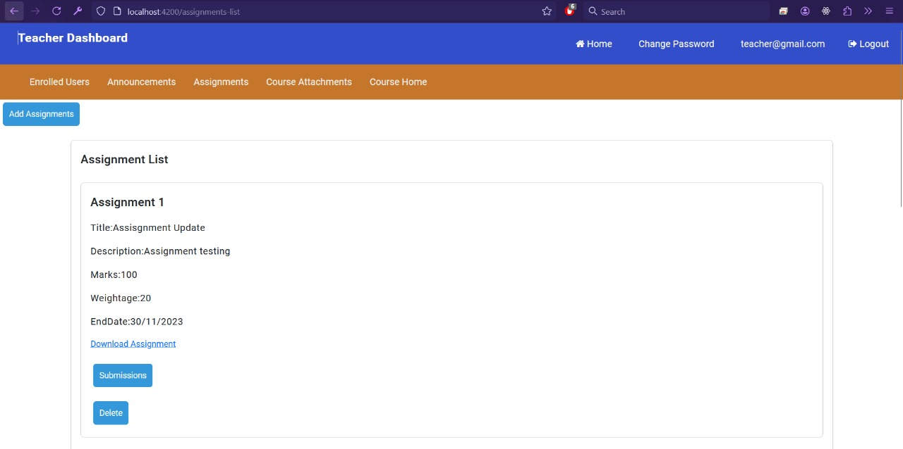
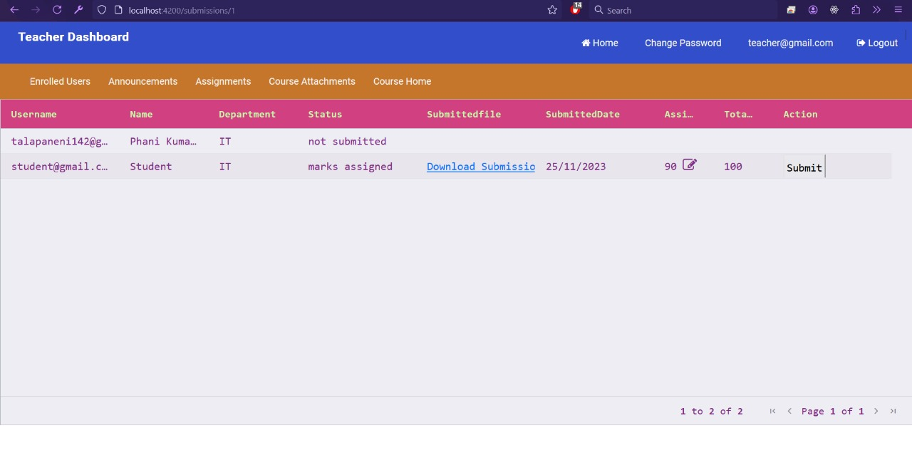
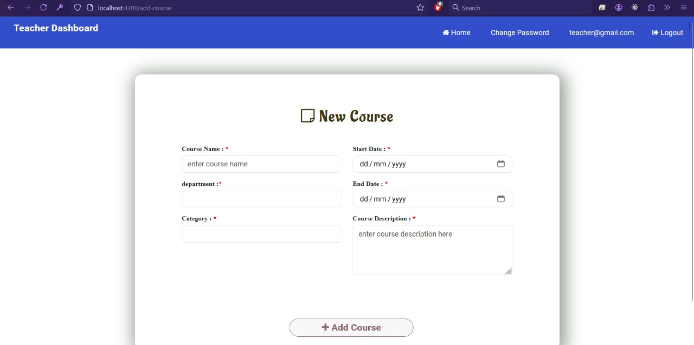
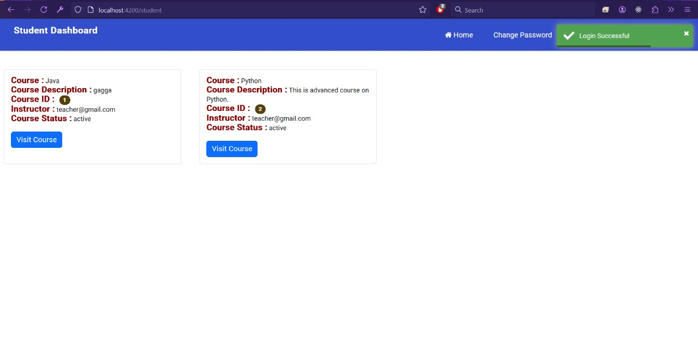

# Online Learning Management System

Online Learning Management System (LMS) built using Spring Boot for the backend and Angular for the frontend.

## Prerequisites

Before you can run the application, you need to have the following software installed:

- Java Development Kit (JDK) - Version 11.0+
- Node.js - Version 16.16.0
- Angular CLI - Version 16.2.2
- MySQL Database

## Backend Setup (Spring Boot)

1. Clone the repository:
   
   git clone https://github.com/Phani-E650/OnlineLearningManagement.git

cd OnlineLearningManagement/backend

spring.datasource.url=jdbc:mysql://localhost:3306/your_db_name

spring.datasource.username=your_db_username

spring.datasource.password=your_db_password

Build and run the Spring Boot application:
./mvnw spring-boot:run

## Frontend Setup (Angular)

cd OnlineLearningManagement/frontend

npm install

ng serve

The frontend now be accessible at http://localhost:4200

<H2> Teacher Dashboard</H2>

<h4>-> Teacher home page where admin can add courses.</h4>

<h4>->Couse page where all the details of course can accessed and the teacher can add the modules in course by respective teacher added by admin</h4>

<h4>-> Attachements related to course can uploaded which can be access by the enrolled users</h4>

<h4>-> The page where teacher can add the students to the course who can access it.</h4>

<h4>-> Assignments Page where teacher can add the assignments that need to be done by the student part of a course and set the deadline where after student cannot submit assignment.</h4>

<h4>-> Teacher can view all the submission done by students to a given assignment and allote marks for the individual student submission</h4>

<h4>-> Teacher or admin can add the course</h4>

<H2> Student Dashboard</H2>

<h4>-> Student home page where student can access the courses for which he had an access.</h4>

